# CareerInfo – Aplikasi Informasi Lowongan Kerja

Link Apk release : https://drive.google.com/file/d/1nMm2UrVp9GAB3ZMJq8oGcxQu6VrMEVzC/view?usp=drivesdk    (Jika Register Role Admin masukan kode : ADMIN123)
Link Github : https://github.com/LitaAlentina287/careerinfo
Link Video : https://youtu.be/iAFURKEX-tY?si=SS9AAYP3z3xLQO1l

## 📌 Deskripsi Project

CareerInfo adalah aplikasi mobile berbasis Android yang dikembangkan untuk memenuhi **UAS Pemrograman Mobile 2**. Aplikasi ini bertujuan untuk memudahkan pengguna dalam **mencari, melamar, dan mengelola informasi lowongan kerja**.

Aplikasi memiliki **dua role pengguna**, yaitu **Admin** dan **Member**, dengan hak akses dan fitur yang berbeda.

---

## 👥 Anggota Kelompok 7

* Lita Alentina_23552011097
* Febry Dian Nugraha_23552011111
* Derian_23552011114

---

## 🛠️ Teknologi yang Digunakan

* **Flutter (SDK ^3.10.0)**
* **Dart**
* Firebase Core
* Firebase Authentication
* Cloud Firestore
* Firebase Storage
* Image Picker
* Intl (format tanggal & waktu)

---

## 🔐 Fitur Authentication

### 1️⃣ Halaman Login

Halaman login digunakan oleh pengguna untuk masuk ke aplikasi menggunakan email dan password yang telah terdaftar. Proses login telah terintegrasi dengan **Firebase Authentication** untuk memastikan keamanan dan validasi data pengguna.

**Contoh akun Admin:**

* Email: [adminkelompok7@gmail.com](mailto:adminkelompok7@gmail.com)
* Password: adminkelompok7!#


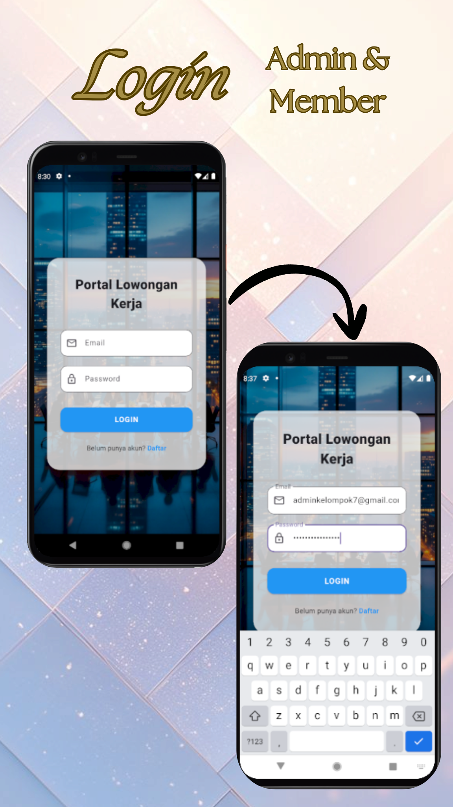


---

### 2️⃣ Halaman Register

Halaman register memungkinkan pengguna membuat akun baru dengan mengisi email, password, dan memilih role pengguna.

Role yang tersedia:

* Member
* Admin

Jika memilih role **Admin**, pengguna wajib memasukkan **kode admin (ADMIN123)** sebagai pengaman.


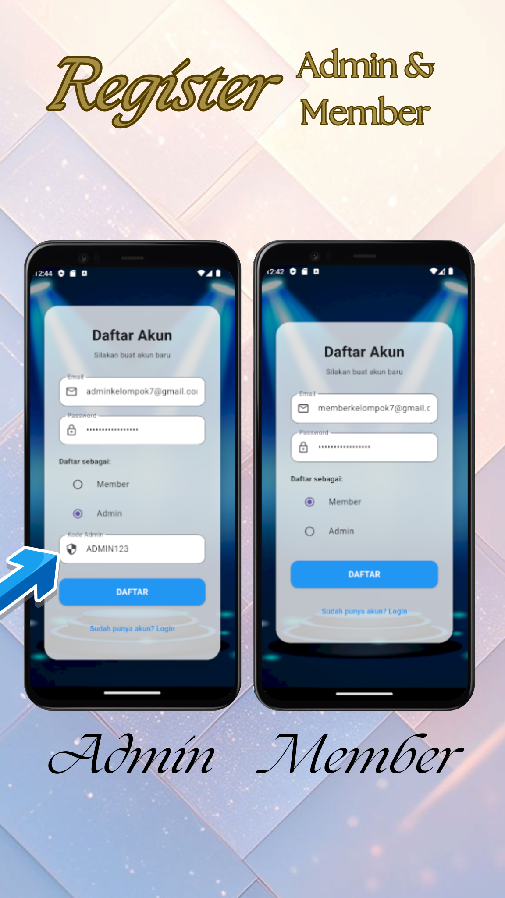


---

## 🧾 Fitur Admin

### 3️⃣ Halaman Input Data Informasi (Job)

Halaman ini hanya dapat diakses oleh Admin. Admin dapat menambahkan data lowongan kerja baru dengan mengisi:

* Logo perusahaan
* Judul lowongan
* Nama perusahaan
* Lokasi
* Deskripsi pekerjaan
* Kualifikasi

Data akan otomatis tersimpan ke **Firebase Firestore**.


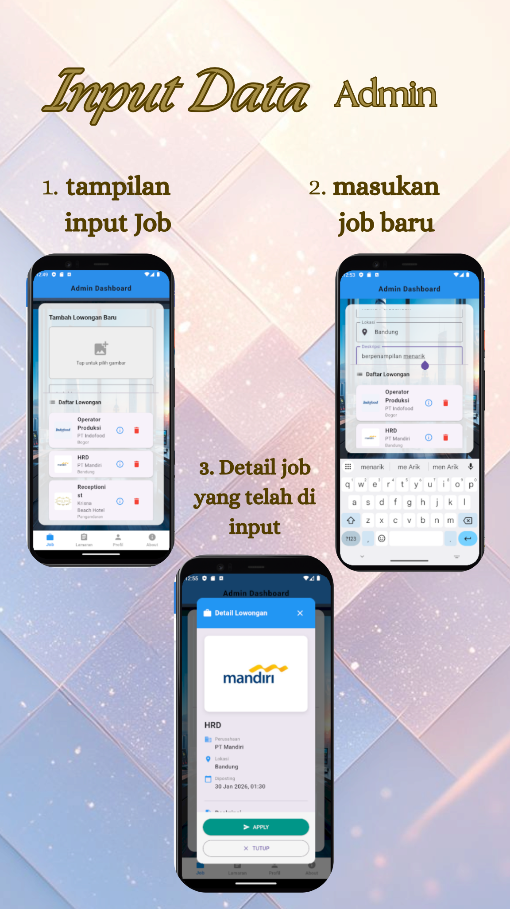


---

### 4️⃣ Halaman List & Searching Informasi

Halaman ini menampilkan seluruh data lowongan kerja dalam bentuk **ListView**. Admin dapat melakukan pencarian berdasarkan **posisi pekerjaan atau nama perusahaan**.
Menampilkan detail lengkap dari lowongan kerja yang dipilih. Admin dapat melakukan:

* Accept lamaran
* Reject lamaran
* Hapus lamaran


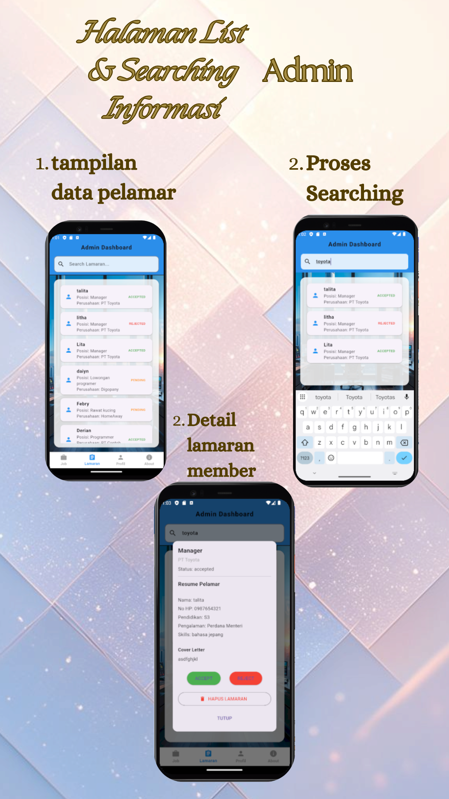


---

## 5️⃣ Halaman About

Halaman About berisi:

* Informasi aplikasi
* Tujuan pembuatan
* Nama anggota dan NPM
* Copyright


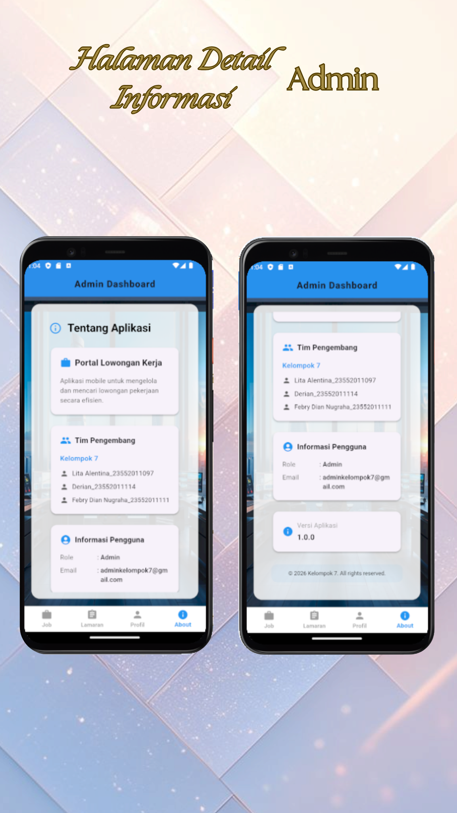


---

### 6️⃣ Halaman Profil Admin

Admin dapat mengubah password dan logout dari aplikasi.


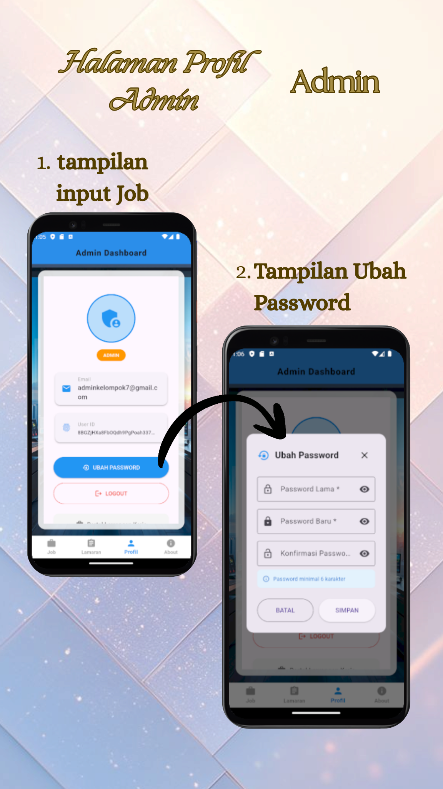


---

## 👤 Fitur Member

### 7️⃣ Halaman Lowongan

Member dapat melihat seluruh lowongan kerja yang tersedia dan mengakses detail lowongan.


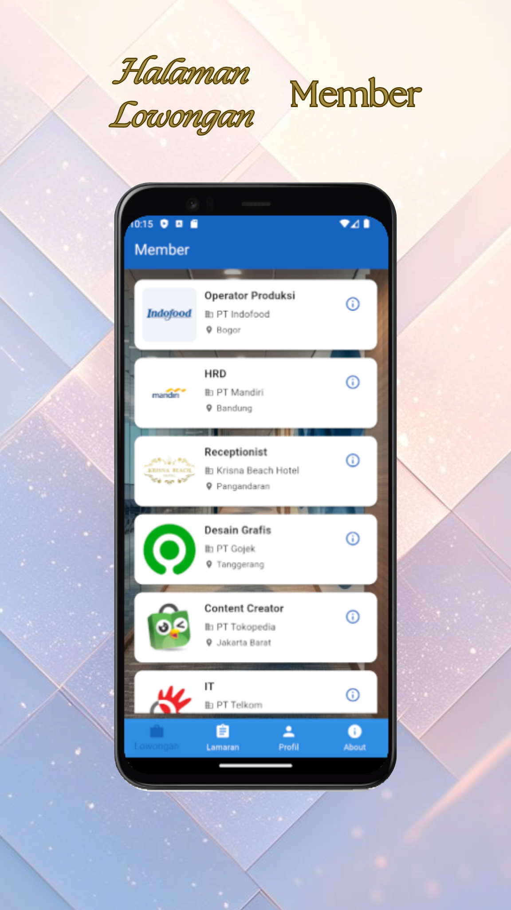


---

### 8️⃣ Halaman Detail & Apply Lamaran

Member dapat melakukan apply lamaran. Status lamaran akan tersimpan dan dikirim ke Admin.

Status lamaran:

* Pending
* Diterima
* Ditolak


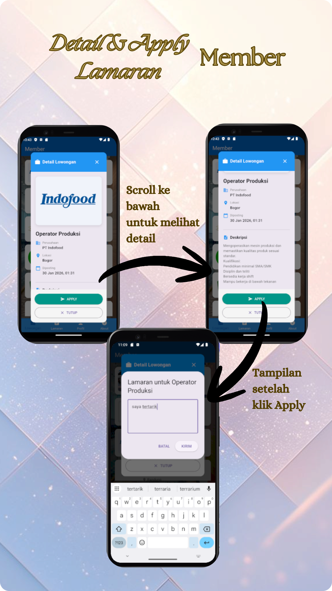


---

### 9️⃣ Halaman Lamaran Member

Menampilkan daftar lamaran yang telah diajukan beserta statusnya.


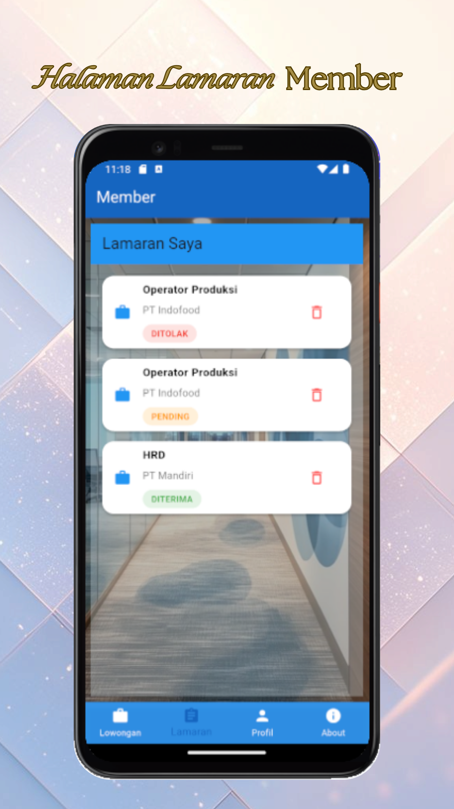


---

### 🔟 Halaman Profil Member

Member dapat mengunggah resume dan logout dari aplikasi.


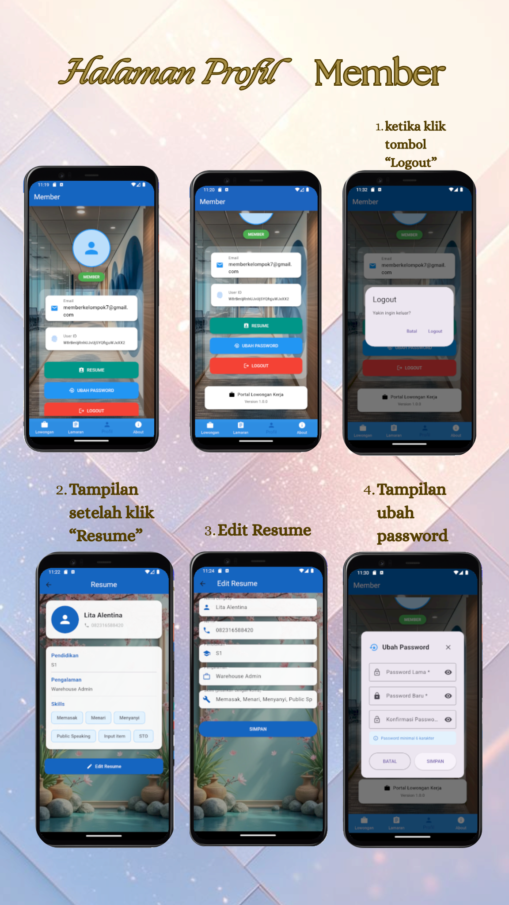


---

## ℹ️ Halaman About

Halaman About berisi:

* Informasi aplikasi
* Tujuan pembuatan
* Nama anggota dan NPM
* Copyright


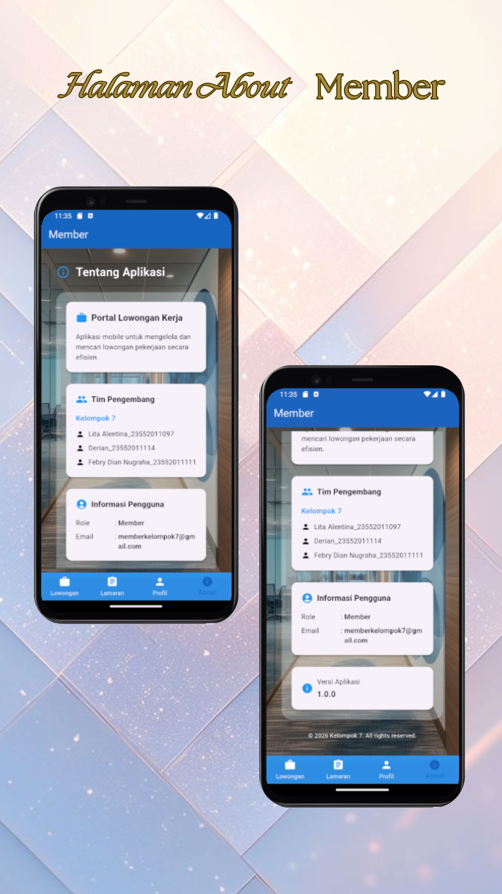


---

## 🧭 Navigasi Aplikasi

Aplikasi menggunakan **Bottom Navigation**, sehingga pengguna dapat berpindah halaman dengan mudah dan cepat.

---

## 🗄️ Integrasi Database

Aplikasi terintegrasi dengan:

* Firebase Authentication (login & register)
* Firebase Firestore (data lowongan & lamaran)
* Firebase Storage (logo perusahaan & resume)

---

## 🌐 Repository GitHub

Seluruh source code project dapat diakses melalui repository GitHub berikut:

```md
https://github.com/username/CareerInfo
```

---

## 🎥 Video Demo Aplikasi

Video demo penggunaan aplikasi dapat dilihat pada link berikut:

```md
https://youtu.be/xxxxxxxxxxx
```

---


## ✅ Penutup

Dengan adanya aplikasi CareerInfo, diharapkan pengguna dapat dengan mudah memperoleh informasi lowongan kerja serta mengelola proses lamaran secara digital.

Terima kasih 🙏
